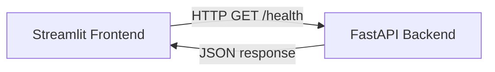

# HR Knowledge Hub

AI-powered Internal HR Knowledge Assistant using Hybrid Retrieval-Augmented Generation (Hybrid RAG).

## Overview

HR Knowledge Hub lets HR teams upload internal documents (handbooks, policies, hiring guidelines) and ask natural-language questions about them. The system retrieves relevant content using hybrid search (dense + BM25), reranks results, and generates grounded answers with citations.

This repository currently implements **Phase 1: Project Foundation** only.

## Problem Statement

HR teams spend significant time manually searching through multiple policy documents, employee handbooks, hiring guidelines, and internship policies to answer routine questions. HR Knowledge Hub centralizes this into a single, ask-a-question interface.

## Features (Phase 1)

- FastAPI backend with `/health` and `/` endpoints
- Streamlit frontend that checks backend connectivity
- Centralized configuration via Pydantic Settings
- Structured logging
- Dockerized backend and frontend, orchestrated with Docker Compose

No document upload, retrieval, embeddings, or chat functionality exists yet — these arrive in later phases.

## Folder Structure

```
backend/
  app/
    api/            # FastAPI routers (health check)
    config/         # Pydantic Settings configuration
    services/       # (empty — future business logic)
    repositories/   # (empty — future data access layer)
    ingestion/       # (empty — future document ingestion)
    retrieval/       # (empty — future hybrid retrieval)
    generation/      # (empty — future LLM generation)
    models/          # (empty — future Pydantic/DB models)
    utils/           # Logging and shared helpers
    main.py          # FastAPI app entrypoint
frontend/
  streamlit_app.py   # Streamlit UI
docs/
requirements.txt
.env.example
Dockerfile
docker-compose.yml
```

## Tech Stack

| Layer | Technology |
|---|---|
| Backend | Python, FastAPI |
| Frontend | Streamlit |
| Embedding Model | NVIDIA NIM Embedding API (Phase 3+) |
| LLM | NVIDIA NIM LLM API (Phase 4+) |
| Reranker | NVIDIA NIM Reranker API (Phase 3+) |
| Vector Database | Pinecone (Phase 2+) |
| Relational Database | Supabase PostgreSQL (Phase 2+) |
| Containerization | Docker |

## Local Setup

### Prerequisites
- Python 3.11+
- Docker (optional, for containerized run)

### Run locally (without Docker)

```bash
python -m venv venv
source venv/bin/activate
pip install -r requirements.txt
cp .env.example .env

# Terminal 1 — backend
cd backend
uvicorn app.main:app --reload

# Terminal 2 — frontend
cd frontend
BACKEND_URL=http://localhost:8000 streamlit run streamlit_app.py
```

Visit:
- Backend: http://localhost:8000/health
- Frontend: http://localhost:8501

### Run with Docker Compose

```bash
cp .env.example .env
docker-compose up --build
```

## Architecture (Phase 1)



## Future Roadmap

- **Phase 2:** Document ingestion (PDF/DOCX parsing, chunking) and Supabase metadata storage
- **Phase 3:** Embedding generation (NVIDIA NIM) and Pinecone vector indexing, hybrid search (dense + BM25)
- **Phase 4:** Reranking (NVIDIA NIM Reranker) and grounded answer generation with citations (NVIDIA NIM LLM)
- **Phase 5:** Chat interface, document management UI, deployment hardening

## Screenshots

_Placeholder — screenshots will be added as features are implemented._

| Screen | Preview |
|---|---|
| Backend health check | _coming soon_ |
| Streamlit UI | _coming soon_ |
