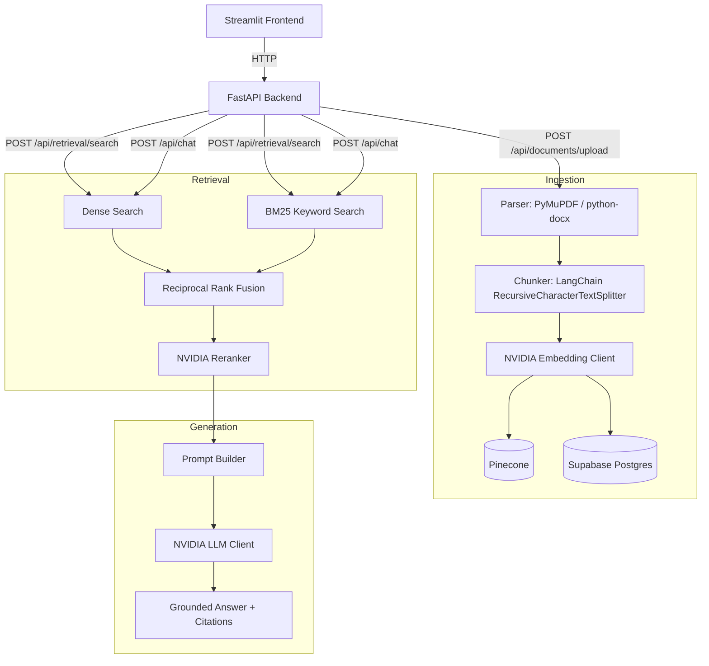
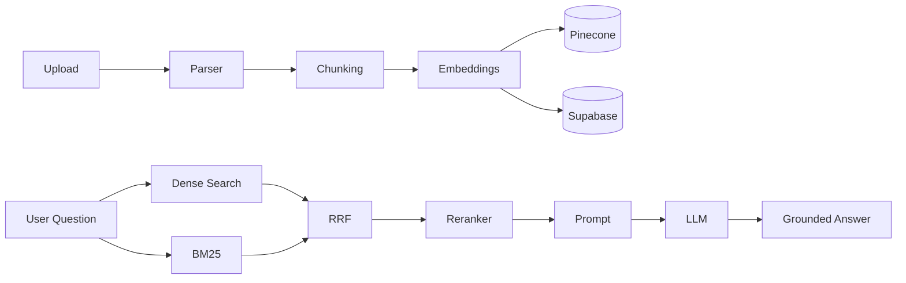

# HR Knowledge Hub

AI-powered Internal HR Knowledge Assistant using Hybrid Retrieval-Augmented Generation (Hybrid RAG).

## Overview

HR Knowledge Hub lets HR teams upload internal documents — handbooks, policies, hiring guidelines — and ask natural-language questions about them. The system retrieves relevant passages using **hybrid search** (dense vector search + BM25 keyword search, merged with Reciprocal Rank Fusion and reranked by an NVIDIA NIM reranker), then generates a grounded answer with citations back to the source documents.

This is a portfolio project built to demonstrate practical RAG engineering: document ingestion, hybrid retrieval, and grounded generation, each implemented as a small, explainable pipeline rather than a framework-driven black box.

## Problem Statement

HR teams spend significant time manually searching through multiple policy documents, employee handbooks, hiring guidelines, and internship policies to answer routine questions. HR Knowledge Hub centralizes this into a single ask-a-question interface, with every answer traceable back to a specific document and page.

## Solution

Upload a PDF or DOCX HR document. The backend parses it, splits it into overlapping chunks, embeds each chunk with an NVIDIA NIM embedding model, and stores the vectors in Pinecone and the chunk text/metadata in Supabase Postgres.

When a question comes in, the backend retrieves candidate chunks with dense search (Pinecone), keyword search (a from-scratch BM25 implementation), fuses the two rankings with Reciprocal Rank Fusion, reranks the fused candidates with an NVIDIA NIM reranker, and — only if retrieval confidence clears a threshold — asks an NVIDIA NIM LLM to answer strictly from that retrieved context. If nothing relevant is found, the system says so instead of guessing.

## Architecture



## Technology Stack

| Layer | Technology |
|---|---|
| Backend | Python, FastAPI |
| Frontend | Streamlit |
| Document Parsing | PyMuPDF (PDF), python-docx (DOCX) |
| Chunking | LangChain `RecursiveCharacterTextSplitter` |
| Embedding Model | NVIDIA NIM Embedding API (`nv-embedqa-e5-v5`) |
| Keyword Search | Hand-written BM25 (no external search engine) |
| Vector Database | Pinecone |
| Reranker | NVIDIA NIM Reranker API |
| Relational Database | Supabase PostgreSQL |
| LLM | NVIDIA NIM Chat Completions API |
| Containerization | Docker, Docker Compose |

## Folder Structure

```
backend/
  app/
    api/            # FastAPI routers (health, documents, retrieval, chat)
    config/         # Pydantic Settings configuration
    ingestion/       # Parse -> chunk -> embed -> index pipeline
    retrieval/       # Dense search, BM25, RRF, reranker, orchestration
    generation/      # Prompt builder, NVIDIA LLM client, generation service
    repositories/    # Supabase document/chunk storage
    models/          # Shared Pydantic request/response schemas
    utils/           # Logging setup
    main.py          # FastAPI app entrypoint
frontend/
  streamlit_app.py   # Dashboard, upload, search & chat, retrieval inspector
requirements.txt
.env.example
Dockerfile
docker-compose.yml
```

## Features

- **Document ingestion** — upload a PDF or DOCX (max 5 MB), parsed, chunked, embedded, and indexed into Pinecone + Supabase in one request.
- **Hybrid retrieval** — choose `semantic` (dense only), `keyword` (BM25 only), or `hybrid` (dense + BM25 + RRF + reranker) per request.
- **Retrieval Inspector** — a debug mode that returns the intermediate results from every retrieval stage, for interview/demo purposes.
- **Grounded answer generation** — the LLM only sees retrieved context, never outside knowledge, and returns an honest "not found" message when retrieval confidence is too low.
- **Citations** — every answer is backed by the filename and page number it came from.
- **Streamlit UI** — a dashboard of documents indexed this session, an upload page, a search/chat page, and a retrieval inspector.

## Hybrid RAG Pipeline



## How Retrieval Works

- **Dense Search** — the query is embedded with the same NVIDIA embedding model used for ingestion, then Pinecone returns the chunks with the closest cosine similarity.
- **BM25** — a small, hand-written BM25 implementation scores every stored chunk's text against the query's tokens using term frequency, inverse document frequency, and document-length normalization. No Elasticsearch/OpenSearch/Whoosh — just the textbook formula.
- **Hybrid Search + RRF** — dense and BM25 each produce a ranked list; **Reciprocal Rank Fusion** merges them by each chunk's *rank* (not its raw score, since cosine similarity, BM25, and reranker scores aren't on the same scale) into one fused ranking.
- **Reranking** — the fused candidates' full text is sent to an NVIDIA NIM reranker model, which re-scores each one against the query for a final ranking.
- **Grounded Generation** — the top reranked chunks are formatted into one prompt (system instructions + context + question) and sent to an NVIDIA NIM LLM. A confidence score is estimated from the average retrieval score (squashed through a sigmoid into 0–100); below a threshold, the LLM is never called and the system returns an explicit "couldn't find enough information" message instead.

## Local Setup

### Prerequisites
- Python 3.9+
- Docker (optional, for containerized run)
- Accounts/API keys for NVIDIA NIM, Pinecone, and Supabase (see below)

### Run locally (without Docker)

```bash
python -m venv venv
source venv/bin/activate
pip install -r requirements.txt
cp .env.example .env   # then fill in your API keys

# Terminal 1 — backend
cd backend
uvicorn app.main:app --reload

# Terminal 2 — frontend
cd frontend
BACKEND_URL=http://localhost:8000 streamlit run streamlit_app.py
```

Visit:
- Backend docs: http://localhost:8000/docs
- Frontend: http://localhost:8501

### Run with Docker Compose

```bash
cp .env.example .env   # then fill in your API keys
docker-compose up --build
```

## Environment Variables

See `.env.example` for the full list. In summary:

| Variable | Purpose |
|---|---|
| `NVIDIA_EMBEDDING_API_KEY`, `NVIDIA_EMBEDDING_URL`, `NVIDIA_EMBEDDING_MODEL` | Query/document embeddings |
| `NVIDIA_RERANKER_API_KEY`, `NVIDIA_RERANKER_URL`, `NVIDIA_RERANKER_MODEL` | Reranking retrieved chunks |
| `NVIDIA_LLM_API_KEY`, `NVIDIA_LLM_URL`, `NVIDIA_LLM_MODEL` | Grounded answer generation |
| `PINECONE_API_KEY`, `PINECONE_INDEX_NAME` | Vector storage for chunk embeddings |
| `SUPABASE_URL`, `SUPABASE_KEY` | Document and chunk text/metadata storage |
| `BACKEND_URL` | Frontend → backend base URL |

NVIDIA API keys are account-level — the same key works across embedding, reranking, and generation, though separate keys can be used per component if preferred.

## Screenshots

_Placeholder — add screenshots of each Streamlit page here._

| Page | Preview |
|---|---|
| Dashboard | _add screenshot_ |
| Upload Documents | _add screenshot_ |
| Search & Chat | _add screenshot_ |
| Retrieval Inspector | _add screenshot_ |

## Future Improvements

These are realistic next steps, not enterprise promises:

- Persist the dashboard's document list server-side (currently session-scoped in Streamlit) via a simple `GET /api/documents` listing endpoint.
- Deduplicate identical citations when multiple retrieved chunks come from the same page.
- Add a small evaluation set to measure retrieval quality (precision@k) across search modes.
- Basic rate limiting on the upload endpoint.

## License

MIT
